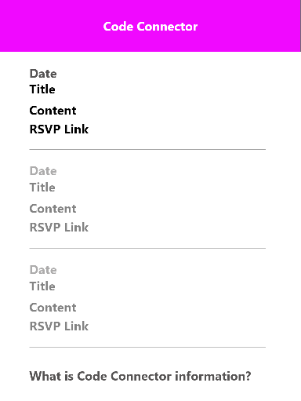

# Code Connector Meetup Calendar Chrome Extension

;

### Table of Contents
1. Purpose
2. Motivation
3. Install
4. Wireframe
5. Technologies Used
6. License

### Purpose:
The purpose is to display upcoming Code Connector tech meetups. There is currently three virtual meetups a month. 

### Motivation:

This project was used to practice developing a chrome extension in preparation of working on the VEVA.ai startup extension project.

### Install
Click to install on a Chrome Browser: [Code Connector Meetup Google Chrome Extension](https://chrome.google.com/webstore/detail/code-connector-meetups-ca/nonnkmloihklfojffnmkedkdeccdnhhf/related?hl=en)

### WireFrame

### This app was built with the following technologies:

**GitHub:** Web-based version control repository and Internet hosting service

**Adobe XD:** A wire-framing tool used to create a mockup/visual of what is to be coded

**JavaScript:** Object-oriented programming language for web pages

**HTML:** Mark-up language for creating web pages

**CSS:** A formatting language for styling web pages

### License  
GNU AFFERO GENERAL PUBLIC LICENSE
_Created by JC Smiley in June of 2020_

